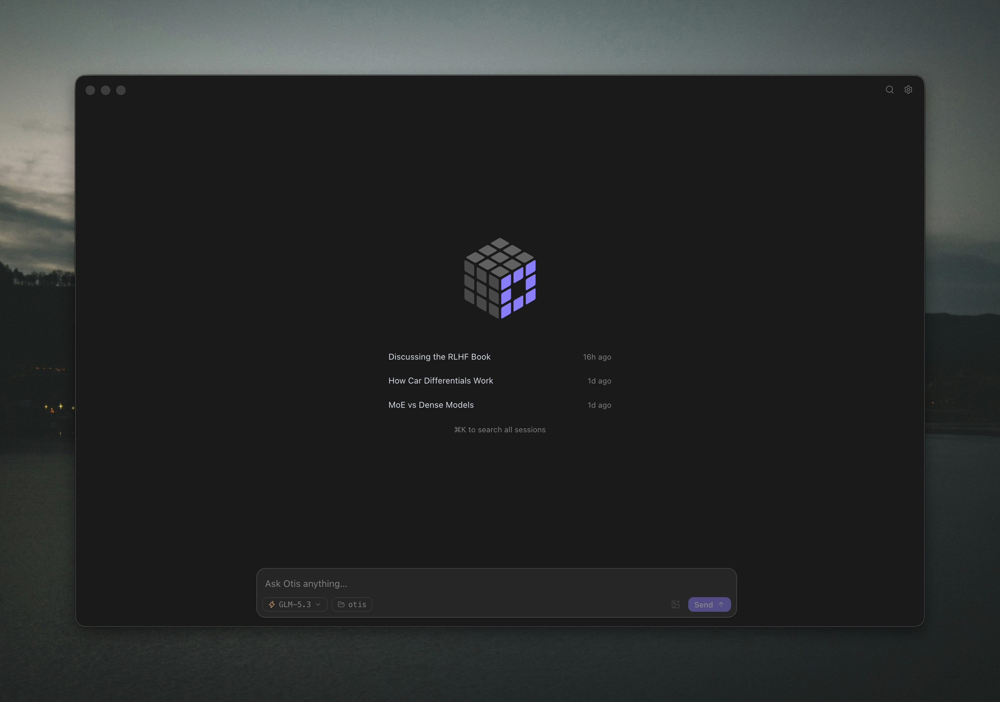

<!-- LOGO -->

<h1>
<p align="center">
  
  <br>Otis
</h1>
  <p align="center">
    Your personal AI agent, powered by open models.
    <br />
    <a href="#why-otis">About</a>
    ·
    <a href="#install">Download</a>
    ·
    <a href="#documentation">Documentation</a>
    ·
    <a href="CONTRIBUTING.md">Contributing</a>
  </p>
</p>

<p align="center">
  
</p>

Otis is an open-source personal AI agent with a native desktop app, an OpenTUI terminal interface, and a headless mode
for scripts and CI. Use it for everyday work, from planning a trip and drafting an email to exploring a codebase and
fixing a bug. Otis can inspect files, edit code, run commands, search the web, and delegate focused work to subagents.

Otis makes local models easy to run. During setup it recommends a model for your hardware, downloads it, and runs it
through llama.cpp. With a local model, Otis works fully offline: there is no account, telemetry, hosted control plane,
or cloud synchronization, and your configuration and history stay on disk.

If you have additional NVIDIA hardware on your network, Otis can connect to an
[NVIDIA PAIR](https://github.com/NVIDIA/Personal-AI-Router) cluster. When you want a larger open-weight model, it can
also connect directly to Fireworks with your own API key; Fireworks documents Zero Data Retention for open-model
inference by default.

## Install

Otis supports macOS and Linux on arm64 and x64.

### Desktop app

Download Otis for macOS or Linux from [triangllabs.ai/otis](https://triangllabs.ai/otis). Every desktop build is also
available from [GitHub Releases](https://github.com/TrianglLabs/otis/releases/latest).

### Terminal

```sh
curl -fsSL https://github.com/triangllabs/otis/releases/latest/download/install.sh | bash
otis
```

Update an existing CLI installation with:

```sh
otis update
```

## Why Otis

- **Your machine, your state.** Configuration, sessions, tool activity, diffs, and usage statistics stay local.
- **Your choice of open model.** Use an Otis-managed GGUF, let PAIR route across your computers, or use Fireworks
  serverless when you want hosted performance.
- **Desktop, terminal, or automation.** Use the native desktop app, the OpenTUI interface, or headless mode with the
  same agent behavior and local sessions.
- **Focused delegation.** Otis can hand off exploration and research to subagents whose work remains inspectable.
- **Direct provider connections.** Hosted inference goes directly to Fireworks with your API key; web access goes
  directly to Parallel's Search MCP.
- **Inspectable history.** Append-only JSONL sessions preserve messages, tool cards, diffs, and provider-reported usage.

## How it works

```txt
Desktop app / OpenTUI terminal / headless CLI
  └─ Otis shared application runtime
      ├─ Conversation lifecycle, tools, permissions, and subagents
      ├─ Private local configuration, sessions, diffs, and stats
      ├─ llama.cpp ── Otis-managed local GGUF inference
      ├─ NVIDIA PAIR ── routing across your local AI cluster
      ├─ Fireworks API ── hosted inference and model discovery
      └─ Parallel Search MCP ── web search and page reading
```

## Get started

Open the desktop app or run `otis`, complete first-time setup, and choose where Otis thinks.

### Local inference

Local inference offers two independent paths:

- **This machine** opens a hardware-aware catalog, downloads a curated and checksum-verified GGUF, and runs it through
  an Otis-managed `llama-server` on `127.0.0.1`.
- **NVIDIA PAIR** connects to PAIR's Ollama or LM Studio proxy on this computer. PAIR then routes each complete request
  to an eligible computer in your cluster.

Neither path requires a hosted inference API key. For a good managed-local experience, use Apple silicon with at least
24 GB of unified memory, or Linux with at least 24 GB of RAM. A Vulkan-capable GPU improves Linux performance.

PAIR is installed and managed separately. Otis pre-fills PAIR's standard loopback addresses; replace either one if the
PAIR Endpoints window shows a custom port. At least one working endpoint is enough. See [NVIDIA PAIR](docs/nvidia-pair.md)
for setup, routing, and model-metadata behavior.

### Hosted inference

Hosted inference uses your own Fireworks API key and has no local hardware requirement. Setup opens the key page and
continues with a public serverless model that Fireworks marks as tool-capable.

| Provider | Used for | Get a key |
| --- | --- | --- |
| Fireworks | Model discovery, inference, streaming, reasoning, and tool calling | [Fireworks API keys](https://app.fireworks.ai/api-keys) |

You can enter the key during setup or provide it through the environment:

```sh
export FIREWORKS_API_KEY=fw_your_key
otis
```

Open `/model` at any time to switch between managed-local, configured PAIR, and hosted models in one picker. The active
model label identifies local models with `Local` and routed models with `NVIDIA PAIR`.

## Terminal commands

The OpenTUI interface supports these commands and controls:

| Command | Action |
| --- | --- |
| `/home` | Return to the home screen |
| `/new` | Start a new session |
| `/history` | Browse, open, or delete local sessions |
| `/model` | Choose a managed-local, PAIR, or hosted model |
| `/settings` | Configure Fireworks or PAIR, delete local models, or toggle debug mode |
| `/fast` | Toggle Fast serving when the current model supports it |
| `/compact [instructions]` | Summarize older conversation and free context |
| `/thinking` | Toggle model-provided thinking traces |
| `/exit` | Exit Otis |

| Control | Action |
| --- | --- |
| `Tab` | Toggle automatic execution and permission prompts |
| `Esc` | Interrupt the active model turn |
| `Ctrl+C` | Exit |

Drag text files, PDFs, DOCX documents, or images into the terminal to attach them to the next message. Otis recognizes
the shell-escaped paths emitted by common macOS and Linux terminals; terminals that expose binary clipboard data can
also attach copied images directly. Numbered tokens appear in the composer, Backspace removes the last attachment when
the input is empty, and attachments clear after the prompt enters the session. Only image attachments require a vision
model.

In Otis Desktop, previewable files open in the session's Canvas. Markdown, plain-text, and self-contained HTML files
refresh automatically when the agent reads, writes, or edits them; the workspace file remains the source of truth, so
the editing behavior is identical in terminal and headless modes. PDF and DOCX files render from their preserved
source bytes. The format-aware `edit_document` tool can replace exact text in workspace DOCX files without flattening
their OOXML structure and fill interactive PDF forms. It creates a validated sibling copy by default. Replacing an
original requires an explicit request and stores the previous version in Otis's private local backup directory. The
plain-text editing tools continue to reject PDF, Word, and other binary files.

For finished deliverables, `publish_artifact` saves a private, immutable preview copy and adds it to the conversation.
This works for files generated or moved by shell commands too; shell output and Markdown links alone do not create
artifact cards. Published copies survive later source edits, moves, or deletion and are restored with the session.
Each new artifact receives an ID. Publish again with that `artifact_id` after editing or moving the same deliverable
to add a revision; titles and file names are not used to guess identity. Cards open the latest revision. Canvas's
version selector can pin an older revision or follow the latest one. Saved revisions and live working files are
visibly distinguished. The selected working file refreshes after external or shell edits, including atomic replacement
and deletion/recreation; a missing source is reported rather than silently showing an older copy.

Publishing an external file asks for permission for that exact file (or follows an explicit permission rule), even in
auto mode. It does not grant general filesystem access or edit permission. Terminal and headless runs use the same
publication and permission logic; graphical previews are Desktop-only. Copies are stored in a private
`<session>.jsonl.artifacts/` directory beside the owning session, deduplicated within that session. Deleting the session
also removes its saved copies, without deleting source files or another session's copies. Ephemeral headless runs do
not offer publication, since they have no owning session.
Publication preserves one file, not its linked assets or JavaScript dependencies; webpage rendering policy is unchanged.

## Headless execution

Use `otis exec` in scripts, CI jobs, containers, or server workers. It runs the same agent turn engine without starting
OpenTUI.

```sh
otis exec "Explain this repository"
otis exec --continue --auto "Run the tests and fix the failure"
otis exec --image screenshot.png "Explain this error"
otis exec --file requirements.pdf --file notes.docx "Compare these documents"
```

Plain output reserves stdout for the final response. JSON and streaming JSONL are available for programmatic use.
Headless mode never prompts and denies unmatched `write`, `edit`, `edit_document`, and `bash` calls unless policy or
`--auto` permits them.
External artifact publication without an explicit allow rule requires interactive approval and is denied in headless
mode, including with `--auto`.
Run `otis exec --help` or read [Headless execution](docs/headless.md) for formats, sessions, limits, permissions, and
file attachments.

## Local data and privacy

Otis writes private configuration and append-only sessions to standard platform user directories. Set `OTIS_HOME` to
keep all state under one location. Provider keys are never written to sessions, transcripts, tool results, or usage
records.

Managed inference stays on loopback. Hosted prompts go directly to Fireworks, which documents Zero Data Retention for
open-model inference by default unless the user opts in; service metadata such as token counts may still be recorded.
Web requests go directly to Parallel, and PAIR owns traffic within the user's cluster.

Read [Local data and privacy](docs/data-and-privacy.md) for paths and retention details, [the architecture guide](docs/architecture.md)
for complete runtime boundaries, and [SECURITY.md](SECURITY.md) for private vulnerability reporting.

## Documentation

- [Desktop app and downloads](https://triangllabs.ai/otis) — native macOS and Linux builds
- [Managed local inference](docs/local-inference.md) — hardware fit, downloads, context, and model deletion
- [NVIDIA PAIR](docs/nvidia-pair.md) — endpoint setup, routing, inventory, and metadata
- [Headless execution](docs/headless.md) — output formats, limits, sessions, and attachments
- [Agent Skills](docs/agent-skills.md) — authoring, precedence, Git-backed collections, and trust
- [Tool permissions](docs/tool-permissions.md) — modes, rule syntax, and policy precedence
- [Local data and privacy](docs/data-and-privacy.md) — storage, secrets, sessions, and network boundaries
- [Architecture](docs/architecture.md) — implementation ownership and runtime boundaries

## Development

[Bun](https://bun.sh/) is the runtime and package manager.

```sh
git clone https://github.com/TrianglLabs/otis.git
cd otis
bun install --frozen-lockfile
bun run dev          # OpenTUI terminal interface
bun run dev:desktop  # Otis Dev, alongside the installed app
```

Desktop development uses a persistent, separate `otis-dev` profile in the platform's application-data directory
(`~/Library/Application Support/otis-dev` on macOS). On first launch it imports your installed Otis configuration,
including saved API keys, and reuses complete model downloads through copy-on-write filesystem clones where supported
(otherwise local copies). Existing dev configuration and model files are never overwritten. Later settings changes,
sessions, runtime processes, and model deletions are independent; deleting a dev model does not delete the installed
app's copy or re-import it on the next launch. Workspace files are still the actual files you open.
No commit or release is needed to test changes. `bun run dev:demo` uses simulated responses for UI work instead.

`OTIS_DEV_USER_DATA` overrides the development profile location. An explicit `OTIS_HOME` overrides Otis's settings,
sessions, and runtime location independently. Either override disables automatic import for isolated tests.

If the desktop renderer crashes, Otis stops the active task and offers to reload the window from the current session;
reloading does not restart interrupted work or queued prompts. `bun run test:desktop:lifecycle` checks this recovery
in an isolated Electron process, including loss of the development launcher's output pipes.

Read [CONTRIBUTING.md](CONTRIBUTING.md) for source boundaries, testing guidance, and the verification checklist.

## License

Otis is released under the [MIT License](LICENSE). Copyright © 2026 Triangl Labs.

The terminal interface is built with [OpenTUI](https://github.com/anomalyco/opentui). Otis-managed local inference uses
[llama.cpp](https://github.com/ggml-org/llama.cpp); PAIR remains a separately installed application. See
[THIRD_PARTY_NOTICES.md](THIRD_PARTY_NOTICES.md) for bundled third-party license notices.
