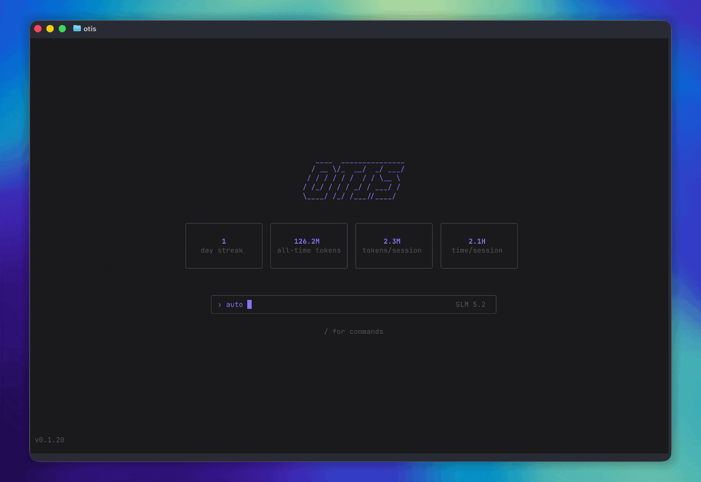

<div align="center">
  
  <p><strong>The local terminal agent powered by open-weight models.</strong></p>
  <p>
    <a href="https://github.com/TrianglLabs/otis/actions/workflows/pr-ci.yml"></a>
    <a href="LICENSE"></a>
    <a href="#install"></a>
  </p>
</div>

<p align="center">
  
</p>

Otis is an open-source interactive agent built for the terminal. Choose a local open-weight model or any public
serverless Fireworks model that supports tools, give Otis a task, and let it inspect files, edit code, run commands,
search the web, and keep a durable local history of the work.

The application, tools, configuration, sessions, diffs, and usage statistics live on your computer. Hosted inference is
provided directly by Fireworks (with Zero Data Retention by default) using your API key. Local models run on your
machine through llama.cpp. Web search and page reading use Parallel's Search MCP from the local runtime.

## Install

Otis supports macOS and Linux on arm64 and x64.

```sh
curl -fsSL https://github.com/triangllabs/otis/releases/latest/download/install.sh | bash
otis
```

The installer verifies the release archive checksum before placing `otis` in `~/.local/bin`. To choose another
location, set `OTIS_INSTALL_DIR` or pass `--install-dir` to the installer.

Update an existing installation with:

```sh
otis update
```

## Why Otis

- **Your machine, your state.** Sessions, configuration, usage, tool activity, and diffs stay local.
- **Your choice of open model.** Run locally when you have the hardware, or use Fireworks serverless when you want even
  more performance.
- **Zero Data Retention (ZDR) inference.** Fireworks does not persist prompts or generations for open models by default
  unless you explicitly opt in. Service metadata such as token counts is still recorded.
- **Inspectable history.** Append-only JSONL sessions retain messages, tool cards, diffs, titles, and provider-reported
  token usage.

## How it works

```txt
Your terminal
  └─ Otis
      ├─ OpenTUI interface, agent loop, and local tools
      ├─ Private local configuration, sessions, diffs, and stats
      ├─ llama.cpp ── local GGUF inference on localhost
      ├─ Fireworks API ── hosted inference and model discovery
      └─ Parallel Search MCP ── web search and page reading
```

## First run

Start `otis` and select **Set up Otis**, then choose where inference runs:

- **Local inference** downloads and runs a model on your machine. For a good experience, use Apple silicon with at
  least 24 GB of unified memory, or Linux with at least 24 GB of RAM. A Vulkan-capable GPU improves speed; 16 GB or
  more of VRAM is recommended. Each model uses 12–19 GB of disk space.
- **Hosted inference** runs remote models using your own API key and has no local hardware requirements. You can
  configure hosted inference later in Settings.

Choosing hosted inference opens the current provider's key page and continues with a verified tool-capable model.
Choosing local opens the hardware-aware local model catalog without requiring a hosted inference API key.

| Provider | Why Otis needs it | Get a key |
| --- | --- | --- |
| Fireworks | Model catalog, inference, streaming, reasoning, and tool calling | [Fireworks API keys](https://app.fireworks.ai/api-keys) |

Keys entered during setup are written atomically to a user-only configuration file. On macOS and Linux, the directory
uses mode `0700` and the file uses mode `0600`. The data lives outside the executable and survives `otis update`.

An environment variable can be used instead of saving the Fireworks key:

```sh
export FIREWORKS_API_KEY=fw_your_key
otis
```

After setup, `/model` lists local llama.cpp models above hosted models. Local inference is supported on macOS and Linux
on arm64 and x64; unsupported platforms show local models as unavailable before a download starts. Selecting a runnable
model downloads Otis' pinned, checksum-verified `llama-server` runtime and a revision-pinned, checksum-verified GGUF
into the local data directory, then serves it on `127.0.0.1`. Interrupted GGUF downloads resume from a partial file;
the complete result must still pass its pinned size and checksum. Download progress and `Downloaded` appear next to
the model name in the picker.

Otis checks whether the model can fit in system memory, including a conservative runtime reserve. On Linux,
llama.cpp uses Vulkan when a render device is present and can split the model between GPU memory and system RAM, so a
smaller GPU does not make a model unavailable. CPU-only inference remains available but is slower. llama.cpp's fitter
chooses the actual context and GPU offload at startup; Otis reports the context the server loaded. Unloaded rows show an
`Est.` context, while the active local model shows `loaded`. Models that cannot fit even 8K stay visible and greyed out.

When at least one GGUF is present, Settings includes a local-model deletion menu. Deleting the active or final local
model stops Otis' `llama-server`; deleting an inactive model leaves the current server untouched.

## Commands and controls

### Headless execution

Use `otis exec` in scripts, CI jobs, containers, or server workers. It runs the same agent turn engine as the terminal
interface without initializing OpenTUI:

```sh
otis exec "Explain this repository"
printf '%s\n' "Review the supplied context" | otis exec --ephemeral --output-format json
otis exec --continue --auto "Run the tests and fix the failure"
otis exec --image screenshot.png "Explain this error"
```

`plain` output writes only the final assistant response to stdout and progress to stderr. `json` writes one result
object, while `jsonl` streams versioned Otis events followed by a result event. Write, edit, and shell calls are denied
unless they match an allow rule or `--auto` is passed. Explicit deny rules remain effective in auto mode. Use repeatable
`--allow`, `--ask`, and `--deny` flags for one-run policy, `--tools` for a narrower comma-separated tool list, and
`--max-steps` and
`--timeout` for execution limits, and `--ephemeral` when no local session should be written. `--continue` resumes the
latest session for the working directory; `--session` resumes a specific session. Model-provided reasoning is omitted
from headless output unless `--include-reasoning` is passed; JSONL then emits structured reasoning lifecycle events and
JSON results include completed traces.
Use repeatable `--image <path>` options to attach PNG, JPEG, GIF, BMP, TIFF, or PPM images. The selected model must
be marked as vision-capable in the Fireworks catalog.

Both interactive and headless runs discover portable Agent Skills automatically. Put personal skills in
`~/.agents/skills/<name>/SKILL.md` and repository skills in `.agents/skills/<name>/SKILL.md`. Repository definitions
override personal definitions with the same name; in nested workspaces, the nearest definition wins.

Install and maintain shared Git-backed skill collections without starting OpenTUI:

```sh
otis skills install https://github.com/obra/superpowers
otis skills list
otis skills update superpowers
otis skills remove superpowers
```

Run `otis exec --help` for the full option list. Headless mode is non-interactive and never displays an approval prompt.

| Command | Action |
| --- | --- |
| `/home` | Return to the home screen |
| `/new` | Start a new session |
| `/history` | Browse, open, or delete local sessions |
| `/model` | Choose a local llama.cpp model or a tool-capable hosted model |
| `/settings` | Configure hosted inference, delete downloaded local models, or toggle debug mode |
| `/fast` | Toggle Fast serving when the current model allows it |
| `/compact [instructions]` | Summarize older conversation and free context |
| `/thinking` | Toggle model-provided thinking traces |
| `/exit` | Exit Otis |

| Control | Action |
| --- | --- |
| `Tab` | Toggle automatic execution and permission prompts |
| `Esc` | Interrupt the active model turn |
| `Ctrl+C` | Exit |

Drag image files into the terminal to attach them to the next message; Otis recognizes the shell-escaped paths emitted
by common macOS and Linux terminals. Numbered image tokens appear inside the composer, Backspace removes the last one
when the text input is empty, and attachments clear after the prompt is admitted to the local session. Terminals that
provide binary clipboard data can attach copied images directly as well.

## Agent Skills

Otis implements the open [Agent Skills specification](https://agentskills.io/specification) with progressive
disclosure. At startup it validates each skill's YAML frontmatter and advertises only `name` and `description` to the
model. When a task matches, the model uses Otis's read-only `skill` tool to load the complete `SKILL.md`, then loads
referenced text resources only as needed.

```txt
.agents/skills/release-notes/
├── SKILL.md
├── references/
│   └── STYLE.md
├── scripts/
│   └── collect-changes.ts
└── assets/
    └── template.md
```

```md
---
name: release-notes
description: Prepare release notes from shipped changes. Use for release summaries and changelogs.
---

# Release notes workflow

Read `references/STYLE.md`, then run `scripts/collect-changes.ts` if change discovery is required.
```

The directory name must match the skill name. Global skills load first, followed by project skill directories from the
filesystem root toward the current working directory, so the closest project definition takes precedence. Skill
resources are confined to their own canonical directory; traversal and escaping symlinks are rejected. Text resources
must be UTF-8. Bundled scripts are not implicitly trusted: the model runs them through the existing `bash` tool and the
normal Otis permission policy still applies. The experimental `allowed-tools` frontmatter field does not bypass Otis
permissions.

`otis skills install <git-url>` accepts a repository containing one root skill, a `skills/*` collection, an
`.agents/skills/*` collection, or a combination of those layouts. Otis keeps an isolated Git checkout in its private
local data directory and activates each discovered skill with a link under `~/.agents/skills`; it never replaces an
existing skill. Use `--name <source-name>` when the repository name is not the desired source name. Updates are
fast-forward-only and transactional, and removal only touches links still owned by Otis. Review third-party skills
before installing them, and restart a running Otis process after an install, update, or removal.

## Local data and privacy

By default, Otis stores data in the platform's standard user directories:

| Data | macOS | Linux |
| --- | --- | --- |
| Configuration | `~/Library/Application Support/otis/config.json` | `~/.config/otis/config.json` |
| Sessions and usage | `~/Library/Application Support/otis/` | `~/.local/share/otis/` |
| Managed skill sources | `~/Library/Application Support/otis/skills/` | `~/.local/share/otis/skills/` |

`XDG_CONFIG_HOME` and `XDG_DATA_HOME` are respected on Linux. Set `OTIS_HOME` to keep all Otis state in one specific
directory.

Provider keys are never written to sessions, transcripts, tool results, or usage records. Model-provided thinking is
part of assistant history and is therefore retained in local sessions even when hidden in the UI. Visible traces show
a three-line preview and can be clicked to expand the complete block. See the
[Fireworks Zero Data Retention policy](https://docs.fireworks.ai/guides/security_compliance/data_handling), the
[architecture guide](docs/architecture.md) for the complete runtime boundaries, and the [security policy](SECURITY.md)
for private vulnerability reporting.

## Tool permissions

Otis evaluates every structured tool call through one permission policy shared by the terminal UI and `otis exec`.
Rules match a tool plus its primary resource: a shell command, workspace-relative path, URL, or search query. Effects
are evaluated with `deny` taking precedence over `ask`, then `allow`. `*` and `?` wildcards are supported.
Shell wildcards do not cross control operators, command substitutions, or redirections; authorize those commands
explicitly or use auto mode when blanket execution is intended.

User rules live in the private local `config.json`:

```json
{
  "version": 1,
  "permissions": {
    "defaultMode": "auto",
    "rules": [
      { "tool": "bash", "resource": "git status", "effect": "allow" },
      { "tool": "bash", "resource": "git push *", "effect": "ask" },
      { "tool": "read", "resource": "*.env", "effect": "deny" }
    ]
  }
}
```

The modes are `ask`, `auto`, and `dontAsk`. Interactive Otis defaults to `auto`; press Tab to switch to `ask`, or set
`permissions.defaultMode` explicitly. Read-only tools are allowed by default; write, edit, and bash resolve to the
selected mode. In headless execution, `ask` fails closed because no approval UI exists. `otis exec` defaults to
`dontAsk`; a configured `auto` default or the `--auto` flag opts into unmatched write, edit, and bash calls.

A repository may add `.otis/permissions.json` with `{ "version": 1, "rules": [...] }`. Project rules may only use
`ask` or `deny`, so opening a repository cannot silently grant itself access. For one headless run, rules use
`tool(resource)` syntax, for example `--allow 'bash(git status)'` or `--deny 'read(*.env)'`.

## Development

[Bun](https://bun.sh/) is the runtime and package manager.

```sh
git clone https://github.com/TrianglLabs/otis.git
cd otis
bun install --frozen-lockfile
bun run dev
```

Before opening a pull request, run:

```sh
bun run verify
bun run build
```

The source tree follows a small set of explicit boundaries:

```txt
src/
  cli/        OpenTUI application and command routing
  core/       Agent loop, project context, and compaction
  inference/  Fireworks and local llama.cpp transport, model policy, and prompt assembly
  local/      Private settings, platform paths, and local statistics
  skills/     Agent Skill discovery, installation, validation, and confined resource loading
  storage/    Append-only session persistence and replay
  tools/      Local tools and provider-neutral web adapters
  web/        Parallel transport and response validation
tests/        Behavioral tests mirroring the source areas above
scripts/      Release build and installer tooling
```

Read [CONTRIBUTING.md](CONTRIBUTING.md) before submitting changes.

## License

Otis is released under the [MIT License](LICENSE). Copyright © 2026 Triangl Labs.

The terminal interface is built with [OpenTUI](https://github.com/anomalyco/opentui). Local inference uses
[llama.cpp](https://github.com/ggml-org/llama.cpp). See [THIRD_PARTY_NOTICES.md](THIRD_PARTY_NOTICES.md) for their
license notices.
