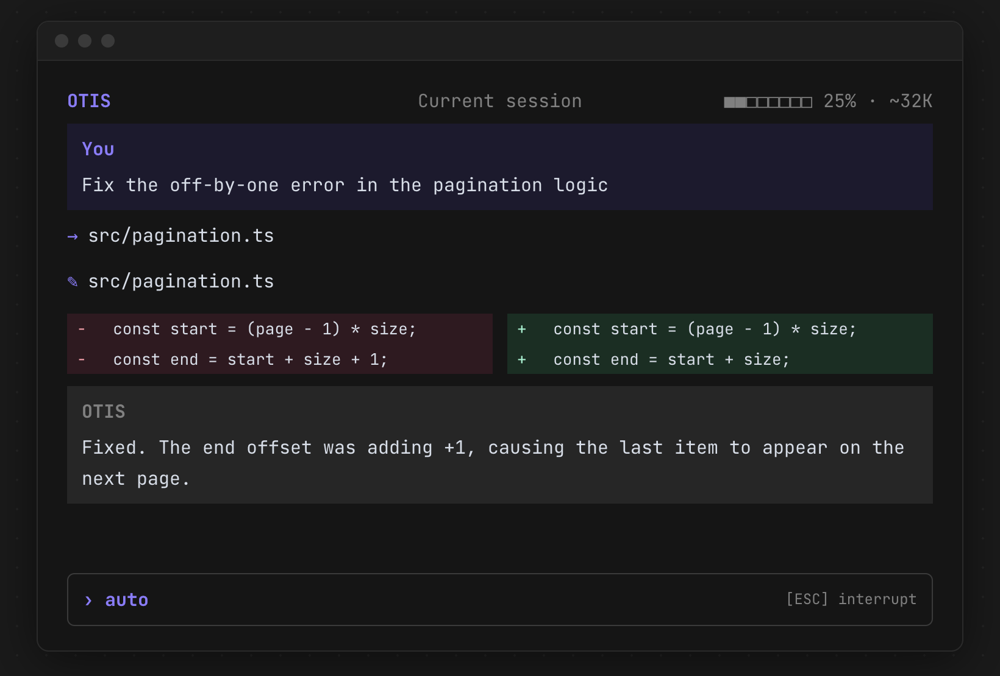

<div align="center">
  
  <p><strong>The local terminal agent powered by open-weight models.</strong></p>
  <p>
    <a href="https://github.com/TrianglLabs/otis/actions/workflows/pr-ci.yml"></a>
    <a href="LICENSE"></a>
    <a href="#install"></a>
  </p>
</div>

Otis is an open-source interactive agent built for the terminal. Choose any public serverless Fireworks model that
supports tools, give Otis a task, and let it inspect files, edit code, run commands, search the web, and keep a durable
local history of the work.

The application, tools, configuration, sessions, diffs, and usage statistics live on your computer. Inference is provided
directly by Fireworks (with Zero Data Retention by default) using your API key; web search and page reading uses Parallel with a separate key.

<p align="center">
  
</p>

## Why Otis

- **Your machine, your state.** Sessions, configuration, usage, tool activity, and diffs stay local.
- **Your choice of open model.** The model picker is populated from Fireworks and only offers public serverless models
  that explicitly support tool calling.
- **Zero Data Retention (ZDR) inference.** Fireworks does not persist prompts or generations for open models by default
  unless you explicitly opt in. Service metadata such as token counts is still recorded.
- **Inspectable history.** Append-only JSONL sessions retain messages, tool cards, diffs, titles, and provider-reported
  token usage.

## How it works

```txt
Your terminal
  └─ Otis
      ├─ OpenTUI interface, agent loop, and local tools
      ├─ Private local configuration, sessions, diffs, and stats
      ├─ Fireworks API ── inference and model discovery
      └─ Parallel API ─── web search and page extraction
```

## Install

Otis supports macOS and Linux on arm64 and x64.

```sh
curl -fsSL https://github.com/triangllabs/otis/releases/latest/download/install.sh | bash
otis
```

The installer verifies the release archive checksum before placing `otis` in `~/.local/bin`. To choose another
location, set `OTIS_INSTALL_DIR` or pass `--install-dir` to the installer.

Update an existing installation with:

```sh
otis update
```

## First run

Start `otis` and select **Set up Otis**. Setup opens each provider's official key page, hides key input, and walks
through model selection before starting a session.

| Provider | Why Otis needs it | Get a key |
| --- | --- | --- |
| Fireworks | Model catalog, inference, streaming, reasoning, and tool calling | [Fireworks API keys](https://app.fireworks.ai/api-keys) |
| Parallel | The `web_search` and `web_read` tools | [Parallel platform](https://platform.parallel.ai/) |

Keys entered during setup are written atomically to a user-only configuration file. On macOS and Linux, the directory
uses mode `0700` and the file uses mode `0600`. The data lives outside the executable and survives `otis update`.

Environment variables can be used instead of saving keys:

```sh
export FIREWORKS_API_KEY=fw_your_key
export PARALLEL_API_KEY=your_parallel_key
otis
```

## Commands and controls

| Command | Action |
| --- | --- |
| `/home` | Return to the home screen |
| `/new` | Start a new session |
| `/history` | Browse, open, or delete local sessions |
| `/model` | Choose another tool-capable Fireworks model |
| `/compact [instructions]` | Summarize older conversation and free context |
| `/debug` | Toggle diagnostic transcript entries |
| `/exit` | Exit Otis |

| Control | Action |
| --- | --- |
| `Tab` | Toggle automatic execution and permission prompts |
| `Esc` | Interrupt the active model turn |
| `Ctrl+C` | Exit |

## Local data and privacy

By default, Otis stores data in the platform's standard user directories:

| Data | macOS | Linux |
| --- | --- | --- |
| Configuration | `~/Library/Application Support/otis/config.json` | `~/.config/otis/config.json` |
| Sessions and usage | `~/Library/Application Support/otis/` | `~/.local/share/otis/` |

`XDG_CONFIG_HOME` and `XDG_DATA_HOME` are respected on Linux. Set `OTIS_HOME` to keep all Otis state in one specific
directory.

Provider keys are never written to sessions, transcripts, tool results, or usage records. See the
[Fireworks Zero Data Retention policy](https://docs.fireworks.ai/guides/security_compliance/data_handling), the
[architecture guide](docs/architecture.md) for the complete runtime boundaries, and the [security policy](SECURITY.md)
for private vulnerability reporting.

## Development

[Bun](https://bun.sh/) is the runtime and package manager.

```sh
git clone https://github.com/TrianglLabs/otis.git
cd otis
bun install --frozen-lockfile
bun run dev
```

Before opening a pull request, run:

```sh
bun run verify
bun run build
```

The source tree follows a small set of explicit boundaries:

```txt
src/
  cli/        OpenTUI application and command routing
  core/       Agent loop, project context, and compaction
  inference/  Fireworks transport, model policy, and prompt assembly
  local/      Private settings, platform paths, and local statistics
  storage/    Append-only session persistence and replay
  tools/      Local tools and provider-neutral web adapters
  web/        Parallel transport and response validation
tests/        Behavioral tests mirroring the source areas above
scripts/      Release build and installer tooling
```

Read [CONTRIBUTING.md](CONTRIBUTING.md) before submitting changes.

## License

Otis is released under the [MIT License](LICENSE). Copyright © 2026 Triangl Labs.

The terminal interface is built with [OpenTUI](https://github.com/anomalyco/opentui). See
[THIRD_PARTY_NOTICES.md](THIRD_PARTY_NOTICES.md) for its license notice.
