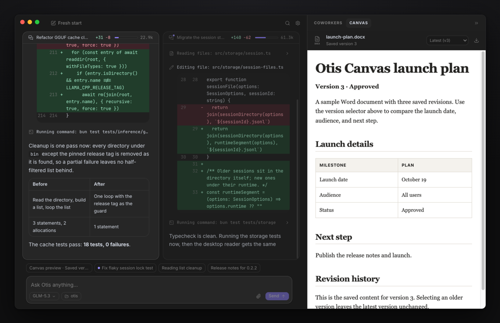
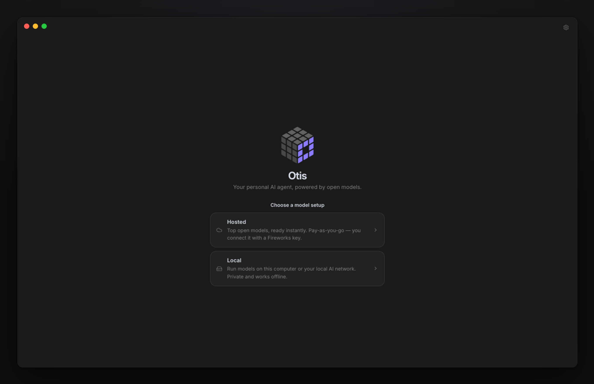
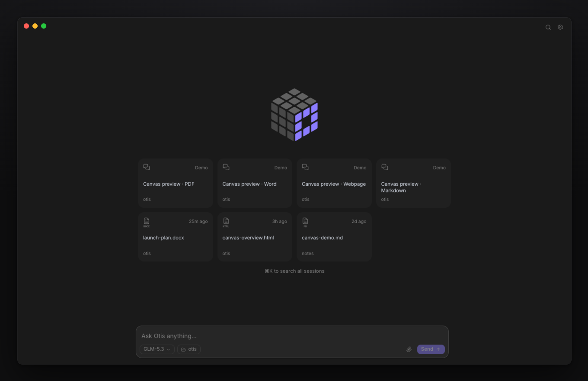
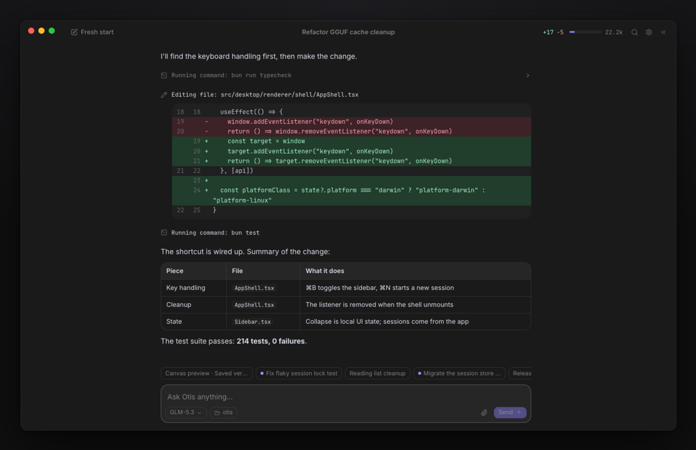
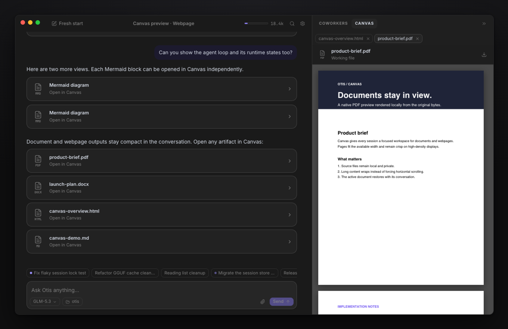
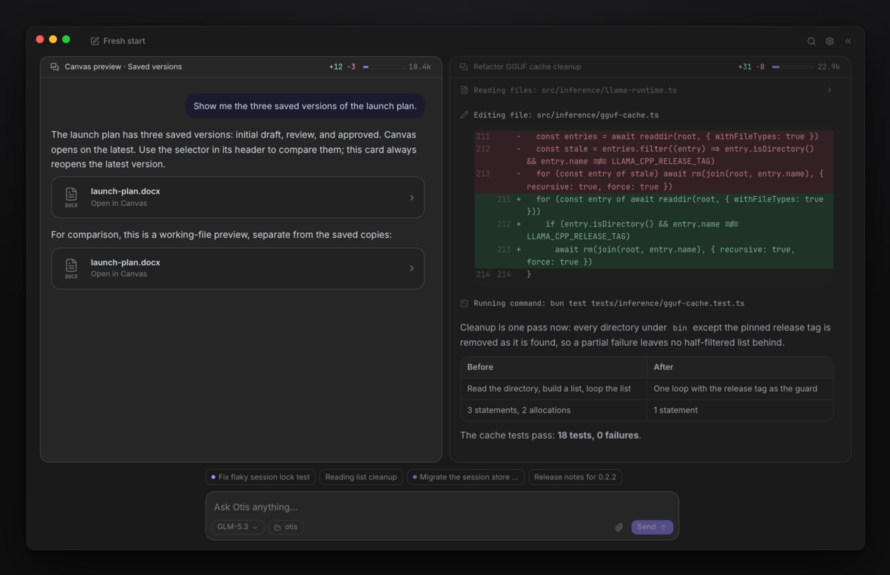
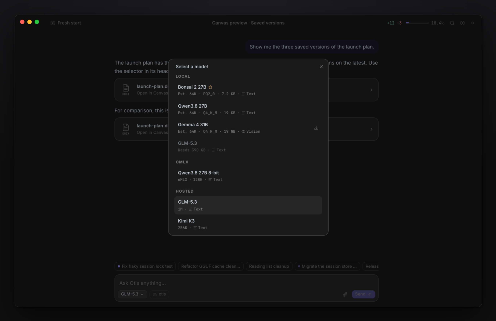

<h1 align="center">
  <br>
  Otis
</h1>

<p align="center">
  <b>A personal AI agent to help you think, create, and get things done.</b><br>
  Powered by open models, on your computer or in the cloud.
</p>

<p align="center">
  <a href="https://triangllabs.ai/otis"><b>Download for macOS and Linux</b></a> ·
  <a href="#install">Terminal install</a> ·
  <a href="#a-session-start-to-finish">Tour</a> ·
  <a href="#documentation">Docs</a>
</p>

<p align="center">
  <a href="https://github.com/TrianglLabs/otis/releases/latest"></a>
  <a href="LICENSE"></a>
  
</p>

<p align="center">
  
</p>

Otis is an AI agent for research, writing, documents, and code. It sets up a local model for your hardware, or
connects to the models you already run.

- **Local models, without the setup work.** Otis recommends a model for your hardware, downloads it, and runs it
  for you. No account, no telemetry, and it works offline.
- **Local or hosted, your call.** Run local models without per-token fees, or use hosted open models with your own
  Fireworks key. Pick the model. Keep the work.
- **Shows its work.** Thinking, every command, every edit as a diff, and an approval before anything risky. Up to
  four sessions side by side, with documents open beside the conversation.
- **Your history stays yours.** Conversations and saved artifacts live on your disk. Hosted inference and web
  search connect directly to their providers.

## Install

**Desktop app.** [triangllabs.ai/otis](https://triangllabs.ai/otis) or
[GitHub Releases](https://github.com/TrianglLabs/otis/releases/latest). macOS and Linux, arm64 and x64.

**Terminal.**

```sh
curl -fsSL https://github.com/triangllabs/otis/releases/latest/download/install.sh | bash
otis
```

Update an existing CLI installation with `otis update`.

## A session, start to finish

<table>
  <tr>
    <td width="38%" valign="middle">
      <b>1. Choose where Otis thinks</b><br><br>
      First launch asks one question. <b>Local</b> recommends the best model for your machine, downloads it, and runs
      it through an Otis-managed llama.cpp server, so Otis works offline. Or connect Ollama, LM Studio, oMLX, or an
      NVIDIA PAIR cluster you already run. <b>Hosted</b> uses your own Fireworks key.
    </td>
    <td width="62%"></td>
  </tr>
  <tr>
    <td valign="middle">
      <b>2. Pick up where you left off</b><br><br>
      Home lists recent sessions and the documents they produced, across every workspace. Open one, or just start
      typing. <code>⌘K</code> searches every session by title and content.
    </td>
    <td></td>
  </tr>
  <tr>
    <td valign="middle">
      <b>3. Ask, then watch it work</b><br><br>
      Every step is visible: the model's thinking, each command, and each edit as a diff. Otis asks before running a
      command or touching a file outside the workspace. Steer the turn or queue a follow-up while it works, and get
      the summary, the diff stats, and the context meter when it ends.
    </td>
    <td></td>
  </tr>
  <tr>
    <td valign="middle">
      <b>4. Review your work in Canvas</b><br><br>
      Preview documents beside your conversation, follow edits, and revisit saved versions. PDFs, Word files,
      Markdown, webpages, and Mermaid diagrams each open as a tab, and nothing leaves your machine to render.
    </td>
    <td></td>
  </tr>
  <tr>
    <td valign="middle">
      <b>5. Run several sessions at once</b><br><br>
      Sessions keep working when you switch away. Chips above the composer show the ones off screen, with a dot for
      the ones still working. Drag a chip onto an edge for up to four side by side, or onto a card to swap. Otis
      notifies you when a background session finishes.
    </td>
    <td></td>
  </tr>
  <tr>
    <td valign="middle">
      <b>6. Pick the model. Keep the work.</b><br><br>
      One picker holds every model Otis can reach: managed local models with their memory needs, models on your own
      servers, and hosted ones. The star marks the local model that fits this computer best.
    </td>
    <td></td>
  </tr>
  <tr>
    <td valign="middle">
      <b>7. Pick up in the terminal, or run it from scripts</b><br><br>
      Work in the desktop app, pick up in the terminal, or run tasks from scripts with the same agent and local
      sessions. <code>otis exec</code> runs a turn headlessly for scripts and CI, with plain, JSON, or streaming
      JSONL output.
    </td>
    <td></td>
  </tr>
</table>

```sh
otis exec "Explain this repository"
otis exec --continue --auto "Run the tests and fix the failure"
otis exec --file requirements.pdf --file notes.docx "Compare these documents"
```

## How it works

```txt
Desktop app / OpenTUI terminal / headless CLI
  └─ Otis shared application runtime
      ├─ Conversation lifecycle, tools, permissions, and coworkers
      ├─ Private local configuration, sessions, diffs, and stats
      ├─ llama.cpp ── Otis-managed local GGUF inference
      ├─ NVIDIA PAIR ── routing across your local AI cluster
      ├─ oMLX ── user-managed MLX inference on Apple Silicon
      ├─ Fireworks API ── hosted inference and model discovery
      └─ Parallel Search MCP ── web search and page reading
```

## Models

**Managed local.** Setup opens a hardware-aware catalog, downloads a curated, checksum-verified GGUF, and runs it
through an Otis-managed `llama-server` on `127.0.0.1`. For a good experience use Apple silicon with at least 24 GB
of unified memory, or Linux with at least 24 GB of RAM; compatible NVIDIA GPUs use CUDA and other Linux GPUs use
Vulkan. See [managed local inference](docs/local-inference.md).

**Local servers.** Connect Ollama or LM Studio through [NVIDIA PAIR](docs/nvidia-pair.md), which routes each request
to an eligible computer in your cluster, or an [oMLX](docs/omlx.md) server on Apple silicon.

**Hosted.** Fireworks with your own [API key](https://app.fireworks.ai/api-keys), entered during setup or from the
environment:

```sh
export FIREWORKS_API_KEY=fw_your_key
otis
```

`/model` in the terminal, or the model chip in the desktop composer, switches between all of them.

## Terminal commands

| Command | Action |
| --- | --- |
| `/home` | Return to the home screen |
| `/new` | Start a new session |
| `/history` | Browse, open, or delete local sessions |
| `/model` | Choose a managed-local, local-server, or hosted model |
| `/settings` | Configure Fireworks or local servers, delete local models, or toggle debug mode |
| `/fast` | Toggle Fast serving when the current model supports it |
| `/compact [instructions]` | Summarize older conversation and free context |
| `/thinking` | Toggle model-provided thinking traces |
| `/exit` | Exit Otis |

| Control | Action |
| --- | --- |
| `Tab` | Toggle automatic execution and permission prompts |
| `Esc` | Interrupt the active model turn |
| `Ctrl+C` | Exit |

Drag text files, PDFs, DOCX documents, or images into the terminal or the desktop composer to attach them to the
next message. Only image attachments need a vision model.

## Documents and artifacts

Otis reads PDF and Word files from their original bytes, edits DOCX text in place without flattening the document,
fills PDF forms, and generates new PDF and Word files through the bundled `documents` skill. Finished deliverables
are published as immutable, versioned copies that survive later edits and restore with the session. Publishing a
file outside the workspace always asks for permission for that exact file. See
[document workflows](docs/document-workflows.md) for capabilities and limits.

## Local data and privacy

Otis writes private configuration and append-only sessions to standard platform user directories; set `OTIS_HOME`
to keep everything under one location. Provider keys are never written to sessions, transcripts, tool results, or
usage records. Managed inference stays on loopback, hosted prompts go directly to Fireworks (which documents Zero
Data Retention for open-model inference by default), web requests go directly to Parallel, and PAIR owns traffic
within your cluster.

Read [local data and privacy](docs/data-and-privacy.md) for paths and retention, the
[architecture guide](docs/architecture.md) for runtime boundaries, and [SECURITY.md](SECURITY.md) for private
vulnerability reporting.

## Documentation

- [Desktop app and downloads](https://triangllabs.ai/otis) — native macOS and Linux builds
- [Managed local inference](docs/local-inference.md) — hardware fit, downloads, context, and model deletion
- [oMLX](docs/omlx.md) — connect an MLX server, authentication, and model metadata
- [NVIDIA PAIR](docs/nvidia-pair.md) — endpoint setup, routing, inventory, and metadata
- [Headless execution](docs/headless.md) — output formats, limits, sessions, and attachments
- [Document workflows](docs/document-workflows.md) — reading, editing, generating, and publishing documents
- [Agent Skills](docs/agent-skills.md) — authoring, precedence, Git-backed collections, and trust
- [Tool permissions](docs/tool-permissions.md) — modes, rule syntax, and policy precedence
- [Local data and privacy](docs/data-and-privacy.md) — storage, secrets, sessions, and network boundaries
- [Architecture](docs/architecture.md) — implementation ownership and runtime boundaries

## Development

[Bun](https://bun.sh/) is the runtime and package manager.

```sh
git clone https://github.com/TrianglLabs/otis.git
cd otis
bun install --frozen-lockfile
bun run dev          # OpenTUI terminal interface
bun run dev:desktop  # Otis Dev, alongside the installed app
bun run dev:demo     # the desktop app with simulated sessions, for UI work
```

Desktop development uses a separate `otis-dev` profile that imports your installed configuration on first launch and
reuses complete model downloads; later changes are independent. `OTIS_DEV_USER_DATA` overrides the profile location
and `OTIS_HOME` overrides Otis's data location. Read [CONTRIBUTING.md](CONTRIBUTING.md) for source boundaries,
testing guidance, and the verification checklist.

## License

Otis is released under the [MIT License](LICENSE). Copyright © 2026 Triangl Labs.

The terminal interface is built with [OpenTUI](https://github.com/anomalyco/opentui). Otis-managed local inference
uses [llama.cpp](https://github.com/ggml-org/llama.cpp); PAIR remains a separately installed application. See
[THIRD_PARTY_NOTICES.md](THIRD_PARTY_NOTICES.md) for bundled third-party license notices.
