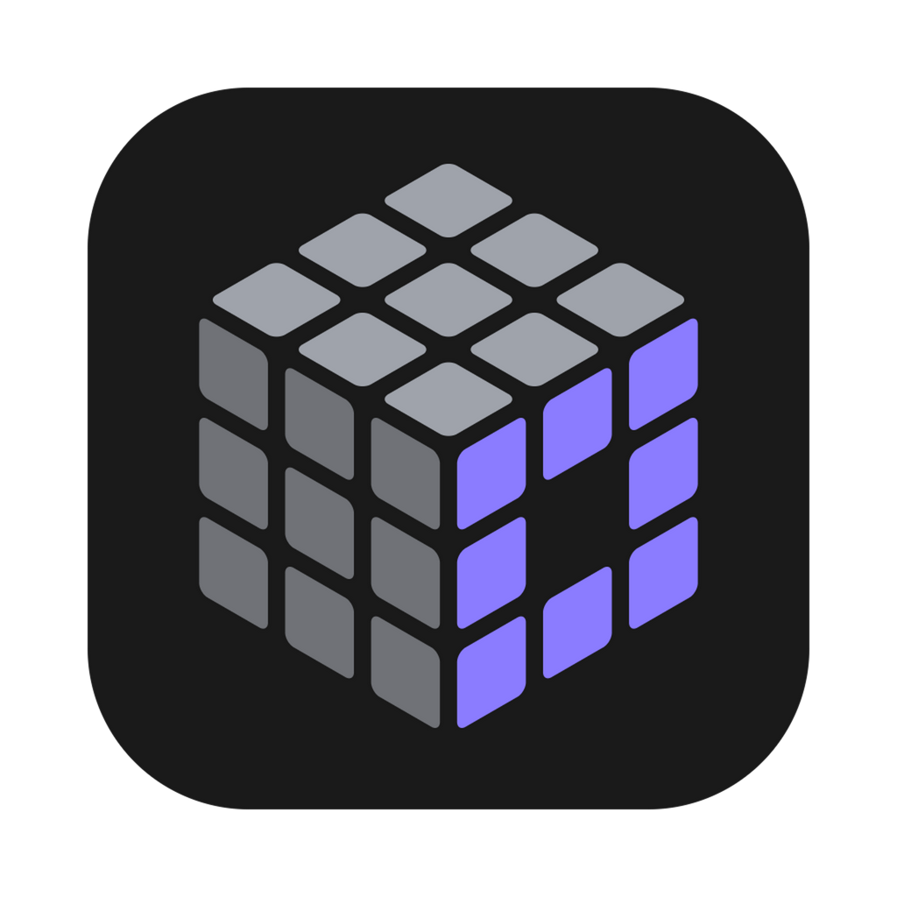
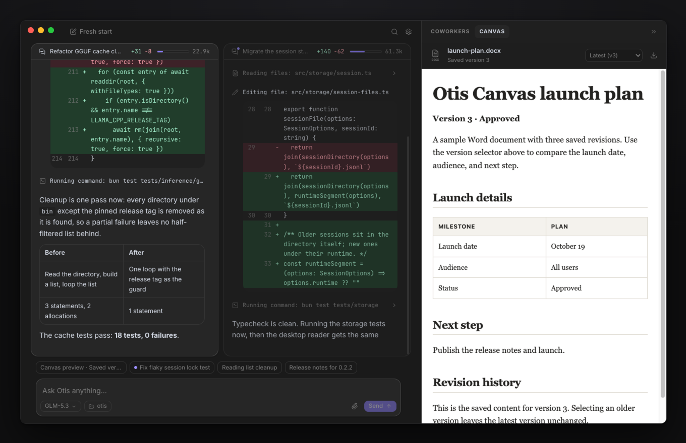
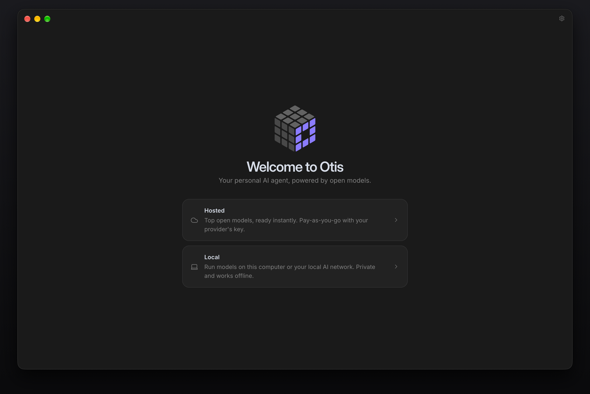
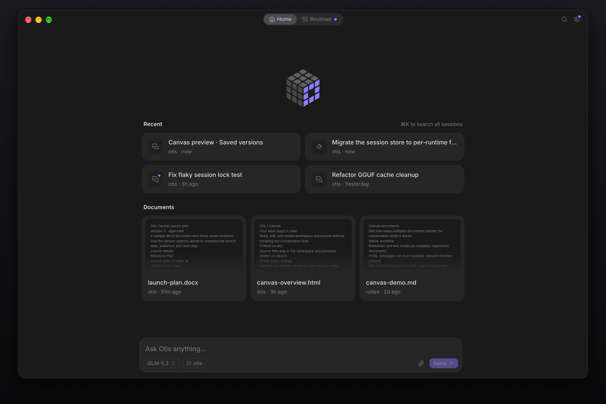
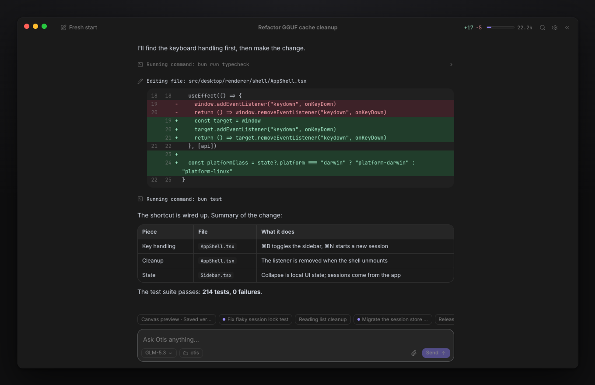
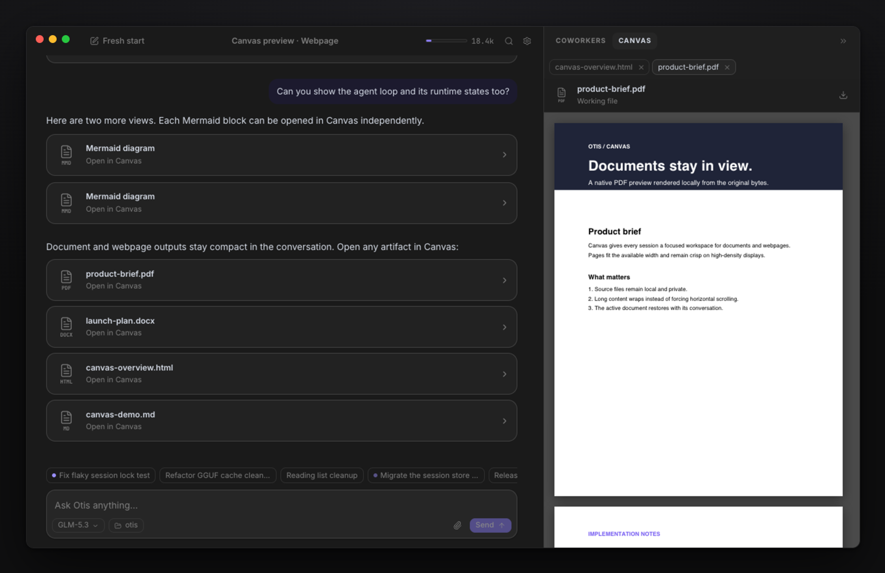
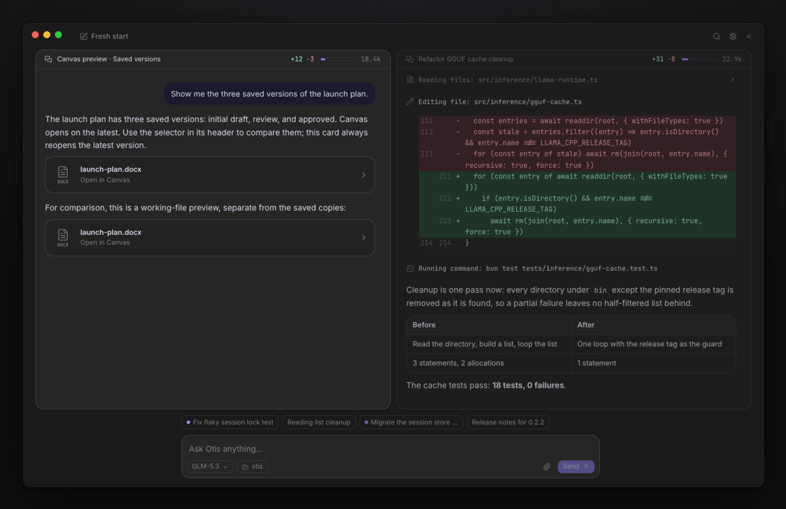
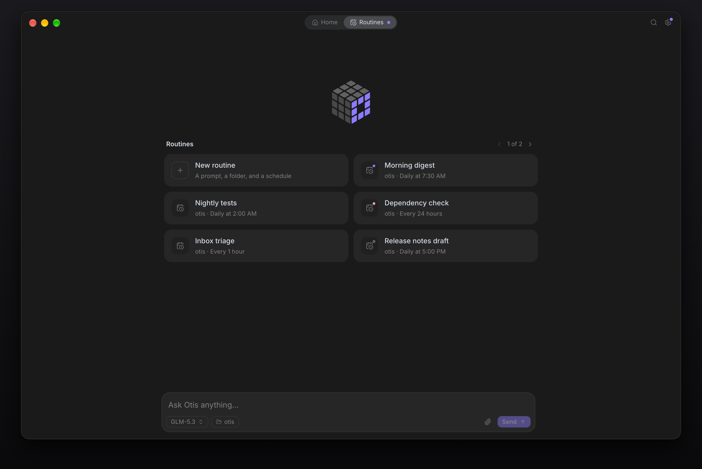
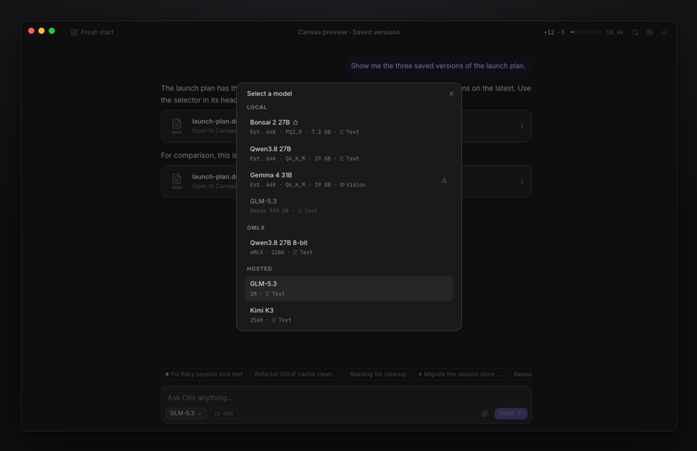
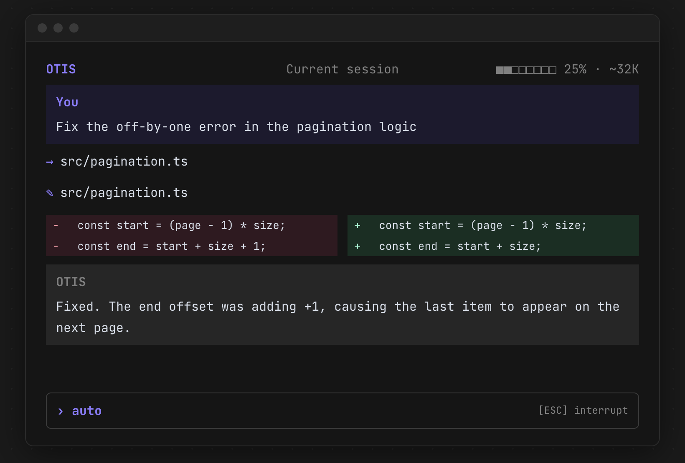

<h1 align="center">
  <br>
  Otis
</h1>

<p align="center">
  <b>A personal AI agent to help you think, create, and get things done.</b><br>
  Powered by open models, on your computer or in the cloud.
</p>

<p align="center">
  <a href="https://triangllabs.ai/otis"><b>Download for macOS and Linux</b></a> ·
  <a href="#install">Terminal install</a> ·
  <a href="#a-session-start-to-finish">Tour</a> ·
  <a href="#documentation">Docs</a>
</p>

<p align="center">
  <a href="https://github.com/TrianglLabs/otis/releases/latest"></a>
  <a href="LICENSE"></a>
  
</p>

<p align="center">
  
</p>

Otis is an AI agent for research, writing, documents, and code. It sets up a local model for your hardware, or
connects to the models you already run.

- **Local models, without the setup work.** Otis recommends a model for your hardware, downloads it, and runs it
  for you. No account, no telemetry, and it works offline.
- **Local or hosted, your call.** Run local models without per-token fees, or use hosted models with your own
  Fireworks, Together AI, Baseten, or Prime Intellect key. Pick the model. Keep the work.
- **Shows its work.** Thinking, every command, every edit as a diff, and an approval before anything risky. Up to
  four sessions side by side, with documents open beside the conversation.
- **Your history stays yours.** Conversations and saved artifacts live on your disk. Hosted inference and web
  search connect directly to their providers.

## Install

**Desktop app.** [triangllabs.ai/otis](https://triangllabs.ai/otis) or
[GitHub Releases](https://github.com/TrianglLabs/otis/releases/latest). macOS and Linux, arm64 and x64.
On Linux, mark the AppImage executable and keep it apart from the terminal command, for example at
`~/.local/bin/otis-desktop`; its launcher entry should point there.

**Terminal.**

```sh
curl -fsSL https://github.com/triangllabs/otis/releases/latest/download/install.sh | bash
otis
```

Update an existing CLI installation with `otis update`.

## A session, start to finish

<table>
  <tr>
    <td width="38%" valign="middle">
      <b>1. Choose where Otis thinks</b><br><br>
      First launch asks one question. <b>Local</b> recommends the best model for your machine, downloads it, and runs
      it through an Otis-managed llama.cpp server, so Otis works offline. Or connect Ollama, LM Studio, oMLX, any
      OpenAI-compatible server you run, or an NVIDIA PAIR cluster you already run. <b>Hosted</b> uses your own Fireworks, Together AI, Baseten, or Prime
      Intellect key.
    </td>
    <td width="62%"></td>
  </tr>
  <tr>
    <td valign="middle">
      <b>2. Pick up where you left off</b><br><br>
      Home lists recent sessions and the documents they produced, across every folder. Open one, or just start
      typing. <code>⌘K</code> searches every session by title and content. The switcher at the top flips to your
      routines.
    </td>
    <td></td>
  </tr>
  <tr>
    <td valign="middle">
      <b>3. Ask, then watch it work</b><br><br>
      Every step is visible: the model's thinking, each command, and each edit as a diff. Otis asks before running a
      command or touching a file outside the workspace. Steer the turn or queue a follow-up while it works, and get
      the summary, the diff stats, and the context meter when it ends.
    </td>
    <td></td>
  </tr>
  <tr>
    <td valign="middle">
      <b>4. Review your work in Canvas</b><br><br>
      Preview documents beside your conversation, follow edits, and revisit saved versions. PDFs, Word files,
      Markdown, webpages, and Mermaid diagrams each open as a tab, and nothing leaves your machine to render.
      A Terminal tab (<code>⌃`</code>) opens your shell in the working folder beside them.
    </td>
    <td></td>
  </tr>
  <tr>
    <td valign="middle">
      <b>5. Run several sessions at once</b><br><br>
      Sessions keep working when you switch away. Chips above the composer show the ones off screen, with a dot for
      the ones still working. Drag a chip, or a session from <code>⌘K</code>, onto an edge for up to four side by
      side, or onto a card to swap. Open a session from history later and the ones it shared the screen with come
      back beside it, as you placed them. Sessions in one window can work in different folders. Otis notifies you
      when a background session finishes.
    </td>
    <td></td>
  </tr>
  <tr>
    <td valign="middle">
      <b>6. Let it run while you are away</b><br><br>
      A routine is a prompt that runs in a folder on a schedule, daily at a time or every so many minutes, on the
      model you choose. Each run is an ordinary session: watch it live, or open it later; a dot marks one you have
      not looked at. Routines only read unless you let them run tools without asking. Ask for one in chat and Otis
      saves it, after asking you first. They run while the app is open, or around the clock under
      <code>otis serve</code>.
    </td>
    <td></td>
  </tr>
  <tr>
    <td valign="middle">
      <b>7. Pick the model. Keep the work.</b><br><br>
      One picker holds every model Otis can reach: managed local models with their memory needs, models on your own
      servers, and hosted ones. The star marks the local model that fits this computer best.
    </td>
    <td></td>
  </tr>
  <tr>
    <td valign="middle">
      <b>8. Pick up in the terminal, or run it from scripts</b><br><br>
      Work in the desktop app, pick up in the terminal, or run tasks from scripts with the same agent and local
      sessions. <code>otis exec</code> runs a turn headlessly for scripts and CI, with plain, JSON, or streaming
      JSONL output.
    </td>
    <td></td>
  </tr>
</table>

```sh
otis exec "Explain this repository"
otis exec --continue --auto "Run the tests and fix the failure"
otis exec --file requirements.pdf --file notes.docx "Compare these documents"
```

## How it works

```txt
Desktop app / OpenTUI terminal / headless CLI
  └─ Otis shared application runtime
      ├─ Conversation lifecycle, tools, permissions, and coworkers
      ├─ Private local configuration, sessions, diffs, and stats
      ├─ llama.cpp ── Otis-managed local GGUF inference
      ├─ NVIDIA PAIR ── routing across your local AI cluster
      ├─ oMLX · any OpenAI-compatible server ── user-managed inference on loopback
      ├─ Fireworks · Together AI · Baseten · Prime Intellect ── hosted inference and model discovery
      └─ Parallel Search MCP ── web search and page reading
```

## Routines

The home screen's Routines tab holds prompts that run on a schedule in a folder of your choice, daily at a time or
every so many minutes, without you at the keyboard. Each run is an ordinary session, on the current model or one you
pick for the routine: it shows up in the session strip while it works, where you can watch it or step in, and stays
in history afterwards. A routine only reads
unless you let it run tools without asking. Routines run while the desktop app is open, or around the clock on a
machine that runs `otis serve`; the terminal can save and list them through the `routines` tool but does not run
them. You can also ask in chat: "run the test suite here every night at two" and Otis saves the routine, after asking
you first. The model cannot grant a routine tools without asking; that switch is yours, in the editor.

## Work on another machine

A machine that stays on can run the Otis runtime as a daemon and the desktop app can work on it:

```sh
otis serve --host <private address>
```

`otis serve` hosts the same runtime the desktop app runs in-process — sessions, models, API keys, skills, memory and
Canvas documents are that machine's — and prints the addresses it is reachable at (the Tailscale one among them) and a
pairing token, created once and reused. In the desktop app, Settings → General → Another
machine takes the address and the token; the app restarts onto the daemon and shows which host it is working on.
Switching back to this machine keeps the pairing, so reconnecting later needs no token, just Connect.
Appearance settings stay with the window. The daemon listens on loopback unless `--host` names an interface; reach it
over a private network such as Tailscale rather than exposing it to the internet. A client that disconnects leaves
the daemon's work running. The terminal panel is not available over a connection yet. Both ends must run the same
Otis version: a daemon on another one is refused with the version it runs and the command that updates it. The
connect form shows how to install Otis on the other machine, and the app keeps the `otis` command installed on
its own machine on its version after each update.

## Other agents on the same machine

Otis reads what other agents already keep, in place: a folder without `AGENTS.md` is read through its `CLAUDE.md`,
`GEMINI.md`, `.github/copilot-instructions.md` or Cursor rules, and skills in `.claude/skills`, `.cursor/skills`,
`.gemini/skills` and `.github/skills` load beside `.agents/skills`, with the same at home for Claude Code, Cursor,
Gemini CLI and GitHub Copilot. Settings → Extensions → Import turns that off. The same page imports what the fallback
cannot read live: Claude Code's, Codex's and Gemini CLI's global
instruction files into `~/AGENTS.md` under a heading per agent, and their memory into Otis' memory as facts, Claude
Code's for the current folder and the others' everywhere, with credentials and personal details stripped. You pick
each item and nothing changes on the other agent's side.

## Models

**Managed local.** Setup opens a hardware-aware catalog, downloads a curated, checksum-verified GGUF, and runs it
through an Otis-managed `llama-server` on `127.0.0.1`. For a good experience use Apple silicon with at least 24 GB
of unified memory, or Linux with at least 24 GB of RAM; compatible NVIDIA GPUs use CUDA and other Linux GPUs use
Vulkan. See [managed local inference](docs/local-inference.md).

**Local servers.** Connect Ollama or LM Studio through [NVIDIA PAIR](docs/nvidia-pair.md), which routes each request
to an eligible computer in your cluster, an [oMLX](docs/local-servers.md) server on Apple silicon, or
[any OpenAI-compatible server](docs/local-servers.md) you run — vLLM, llama.cpp, NInfer, your own.

**Hosted.** [Fireworks](https://app.fireworks.ai/api-keys), [Together AI](https://api.together.ai/settings/projects/~current/api-keys),
[Baseten](https://app.baseten.co/settings/api_keys), or [Prime Intellect](https://app.primeintellect.ai/dashboard/tokens)
with your own API key, entered during setup, from `/settings`, or from the environment:

```sh
export FIREWORKS_API_KEY=fw_your_key   # or TOGETHER_API_KEY, BASETEN_API_KEY, PRIME_API_KEY
export PRIME_TEAM_ID=team_id           # optional: bill Prime Intellect to a team wallet
otis
```

Each provider you add gets its own section in `/model`; type to search the list.

`/model` in the terminal, or the model chip in the desktop composer, switches between all of them.

## Terminal commands

| Command | Action |
| --- | --- |
| `/home` | Return to the home screen |
| `/new` | Start a new session |
| `/history` | Browse, open, or delete local sessions |
| `/model` | Choose a managed-local, local-server, or hosted model |
| `/settings` | Add hosted provider keys, hide hosted models from the picker, configure local servers, delete local models, or toggle debug mode |

The desktop app has the same under Settings → Inference (a switch per hosted model), and Settings → Usage shows token
usage by day and model.
| `/skills` | List loaded Agent Skills; install, update, or remove Git collections |
| `/memory` | See what Otis remembers for this workspace; add or forget a fact |
| `/fast` | Toggle Fast serving when the current model supports it |
| `/compact [instructions]` | Summarize older conversation and free context |
| `/thinking` | Toggle model-provided thinking traces |
| `/exit` | Exit Otis |

| Control | Action |
| --- | --- |
| `Tab` | Toggle automatic execution and permission prompts |
| `Esc` | Interrupt the active model turn |
| `Ctrl+C` | Exit |

Drag text files, PDFs, DOCX documents, or images into the terminal or the desktop composer to attach them to the
next message. Only image attachments need a vision model.

## Documents and artifacts

Otis reads PDF and Word files from their original bytes, edits DOCX text in place without flattening the document,
fills PDF forms, and generates new PDF and Word files through the bundled `documents` skill. Finished deliverables
are published as immutable, versioned copies that survive later edits and restore with the session. Publishing a
file outside the workspace always asks for permission for that exact file. See
[document workflows](docs/document-workflows.md) for capabilities and limits.

## Local data and privacy

Otis writes private configuration and append-only sessions to standard platform user directories; set `OTIS_HOME`
to keep everything under one location. A desktop app paired with `otis serve` works on that machine's data; what
crosses the wire is the conversation, Canvas content and settings the window shows, never a provider key. Provider keys are never written to sessions, transcripts, tool results, or
usage records. Managed inference stays on loopback, hosted prompts go directly to the provider you selected (Fireworks
documents Zero Data Retention for open-model inference by default; check the others' data policies), web requests go
directly to Parallel, and PAIR owns traffic within your cluster.

Otis keeps a small memory: facts the agent or you save with `remember` land in Otis' data folder, in a `memory/`
folder beside the working folder's sessions or in one for everything that holds everywhere; nothing is written into
your project. Each folder follows the Agent Memory Repo layout: `MEMORY.md` is the entry point, linking the topic
files and holding whatever every session should know, and each fact is one Markdown bullet with the session it came
from and the date. Only `MEMORY.md` goes into the prompt, so the model knows the topics and the cost stays a few
lines; it reads a topic, or searches the facts and your past sessions in every workspace by the words of its query,
only when it calls `recall`. Memory is for the project and your
tooling, not for people: the agent is told not to save personal details, and credentials, email addresses, phone,
card and national-id numbers are stripped from anything saved or recalled. The files are plain Markdown you can edit;
the Extensions settings tab lists and edits them too. Make a memory folder itself a git repository, or clone one your
other agents share into its place, and Otis commits every change there; pushing stays yours. A repository further up,
such as a home directory under version control, is left alone. What `recall` returns goes to whichever model is
answering, so with a hosted model it leaves your machine like the rest of the conversation.

Read [local data and privacy](docs/data-and-privacy.md) for paths and retention, the
[architecture guide](docs/architecture.md) for runtime boundaries, and [SECURITY.md](SECURITY.md) for private
vulnerability reporting.

## Documentation

- [Desktop app and downloads](https://triangllabs.ai/otis) — native macOS and Linux builds
- [Managed local inference](docs/local-inference.md) — hardware fit, downloads, context, and model deletion
- [User-managed servers](docs/local-servers.md) — oMLX, NInfer, Strata, and any OpenAI-compatible server: connection,
  keys, model metadata
- [NVIDIA PAIR](docs/nvidia-pair.md) — endpoint setup, routing, inventory, and metadata
- [Headless execution](docs/headless.md) — output formats, limits, sessions, and attachments
- [Document workflows](docs/document-workflows.md) — reading, editing, generating, and publishing documents
- [Agent Skills](docs/agent-skills.md) — authoring, precedence, Git-backed collections, and trust
- [Tool permissions](docs/tool-permissions.md) — modes, rule syntax, and policy precedence
- [Local data and privacy](docs/data-and-privacy.md) — storage, secrets, sessions, and network boundaries
- [Architecture](docs/architecture.md) — implementation ownership and runtime boundaries

## Development

[Bun](https://bun.sh/) is the runtime and package manager.

```sh
git clone https://github.com/TrianglLabs/otis.git
cd otis
bun install --frozen-lockfile
bun run dev          # OpenTUI terminal interface
bun run dev:desktop  # Otis Dev, alongside the installed app
bun run dev:demo     # the desktop app with simulated sessions, for UI work
```

Desktop development uses a separate `otis-dev` profile that imports your installed configuration on first launch and
reuses complete model downloads; later changes are independent. `OTIS_DEV_USER_DATA` overrides the profile location
and `OTIS_HOME` overrides Otis's data location. Read [CONTRIBUTING.md](CONTRIBUTING.md) for source boundaries,
testing guidance, and the verification checklist.

## License

Otis is released under the [MIT License](LICENSE). Copyright © 2026 Triangl Labs.

See [THIRD_PARTY_NOTICES.md](THIRD_PARTY_NOTICES.md) for bundled third-party license notices.
